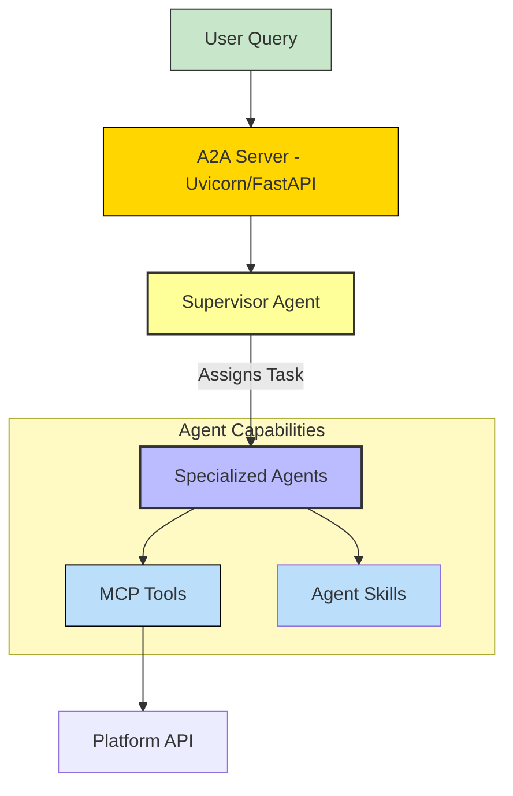
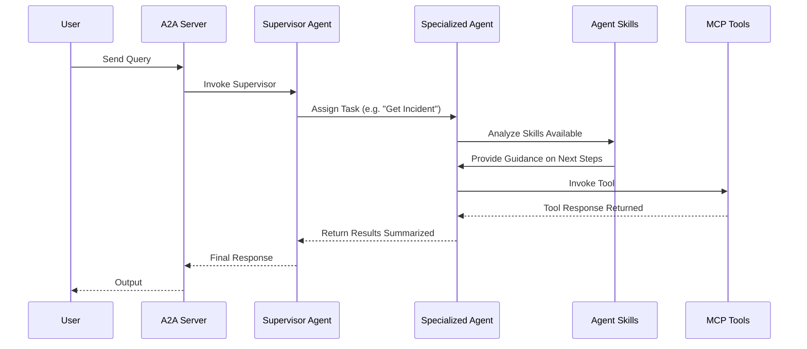

# ServiceNow - API | MCP | A2A | AG-UI


*Version: 1.5.9*

## Overview

This project started out as a python wrapper for ServiceNow, but since the dawn of standards like
Model Context Protocol (MCP) and Agent2Agent (A2A) Agent. This Agent has solved the issue with **tons** of MCP tools by distributing those tools to **child agents**.
This allows you to run this entire agent on a small context window and maintain blazing speed! A 10K Context token minimum recommended, although I got away with 4K in some tests using qwen-4b on default settings.

This repository has become a sandbox for some brand new and pretty cool features with respects to each of those.
The original APIs should remain stable,
but please note, the latest features like A2A may still be unstable as it is under active development.

This project now includes an MCP server, which wraps all the original APIs you know and love in the base project. This
allows any MCP capable LLM to leverage these tools and interact with ServiceNow. The MCP Server is enhanced with
various authentication mechanisms, middleware for observability and control,
and optional Eunomia authorization for policy-based access control.

ServiceNow A2A implements a multi-agent system designed to manage and interact with ServiceNow tasks through a delegated,
specialist-based architecture. Built using Python, it leverages libraries like `pydantic-ai` for agent creation,
`FastMCPToolset` for integrating Model Context Protocol (MCP) tools, and `Graphiti`
for building a temporal knowledge graph from official ServiceNow documentation.
The system runs as a FastAPI server via Uvicorn, exposing an Agent-to-Agent (A2A) interface for handling requests.
`pydantic-ai` is able to expose your agent as an A2A agent out of the box with `.to_a2a()`.
This allows this agent to be integrated in
any agentic framework like `Microsoft Agent Framework` (MAF) or `crew.ai`.
The core idea is a **Supervisor Agent** that acts as an intelligent router. It analyzes user queries and assigns tasks to specialized **child agents**,
each focused on a specific domain (e.g., incidents, change management).
Child agents have access to filtered MCP tools and a shared knowledge graph for reasoning over documentation,
ensuring accurate and context-aware executions without direct access to the underlying APIs from the orchestrator.

This architecture is optimized for:
- **Speed**: Parallel execution potential and smaller context windows per agent.
- **Context Usage**: Each agent only loads the tools and skills relevant to its domain, allowing the system to handle hundreds of MCP tools without exceeding token limits or confusing the LLM.
- **Modularity**: New domains can be added as simple child agents without touching the core supervisor logic.

This architecture promotes modularity, scalability, and maintainability, making it suitable for enterprise
integrations with platforms like ServiceNow.

Contributions are welcome!

## API

### API Calls
- Application Service
- Change Management
- CI/CD
- CMDB
- Import Sets
- Incident
- Knowledge Base
- Table
- Custom Endpoint

If your API call isn't supported, you can use the `api_request` tool to perform GET/POST/PUT/DELETE requests to any ServiceNow endpoint.

## MCP

All the available API Calls above are wrapped in MCP Tools. You can find those below with their tool descriptions and associated tag.

### MCP Tools

| Function Name                              | Description                                                                                                                | Tag(s)                  |
|--------------------------------------------|----------------------------------------------------------------------------------------------------------------------------|-------------------------|
| get_application                            | Retrieves details of a specific application from a ServiceNow instance by its unique identifier.                           | application            |
| get_cmdb                                   | Fetches a specific Configuration Management Database (CMDB) record from a ServiceNow instance using its unique identifier. | cmdb                   |
| batch_install_result                       | Retrieves the result of a batch installation process in ServiceNow by result ID.                                           | cicd                   |
| instance_scan_progress                     | Gets the progress status of an instance scan in ServiceNow by progress ID.                                                 | cicd                   |
| progress                                   | Retrieves the progress status of a specified process in ServiceNow by progress ID.                                         | cicd                   |
| batch_install                              | Initiates a batch installation of specified packages in ServiceNow with optional notes.                                    | cicd                   |
| batch_rollback                             | Performs a rollback of a batch installation in ServiceNow using the rollback ID.                                           | cicd                   |
| app_repo_install                           | Installs an application from a repository in ServiceNow with specified parameters.                                         | cicd                   |
| app_repo_publish                           | Publishes an application to a repository in ServiceNow with development notes and version.                                 | cicd                   |
| app_repo_rollback                          | Rolls back an application to a previous version in ServiceNow by sys_id, scope, and version.                               | cicd                   |
| full_scan                                  | Initiates a full scan of the ServiceNow instance.                                                                          | cicd                   |
| point_scan                                 | Performs a targeted scan on a specific instance and table in ServiceNow.                                                   | cicd                   |
| combo_suite_scan                           | Executes a scan on a combination of suites in ServiceNow by combo sys_id.                                                  | cicd                   |
| suite_scan                                 | Runs a scan on a specified suite with a list of sys_ids and scan type in ServiceNow.                                       | cicd                   |
| activate_plugin                            | Activates a specified plugin in ServiceNow by plugin ID.                                                                   | plugins                |
| rollback_plugin                            | Rolls back a specified plugin in ServiceNow to its previous state by plugin ID.                                            | plugins                |
| apply_remote_source_control_changes        | Applies changes from a remote source control branch to a ServiceNow application.                                           | source_control         |
| import_repository                          | Imports a repository into ServiceNow with specified credentials and branch.                                                | source_control         |
| run_test_suite                             | Executes a test suite in ServiceNow with specified browser and OS configurations.                                          | testing                |
| update_set_create                          | Creates a new update set in ServiceNow with a given name, scope, and description.                                          | update_sets            |
| update_set_retrieve                        | Retrieves an update set from a source instance in ServiceNow with optional preview and cleanup.                            | update_sets            |
| update_set_preview                         | Previews an update set in ServiceNow by its remote sys_id.                                                                 | update_sets            |
| update_set_commit                          | Commits an update set in ServiceNow with an option to force commit.                                                        | update_sets            |
| update_set_commit_multiple                 | Commits multiple update sets in ServiceNow in the specified order.                                                         | update_sets            |
| update_set_back_out                        | Backs out an update set in ServiceNow with an option to rollback installations.                                            | update_sets            |
| get_change_requests                        | Retrieves change requests from ServiceNow with optional filtering and pagination.                                          | change_management      |
| get_change_request_nextstate               | Gets the next state for a specific change request in ServiceNow.                                                           | change_management      |
| get_change_request_schedule                | Retrieves the schedule for a change request based on a Configuration Item (CI) in ServiceNow.                              | change_management      |
| get_change_request_tasks                   | Fetches tasks associated with a change request in ServiceNow with optional filtering.                                      | change_management      |
| get_change_request                         | Retrieves details of a specific change request in ServiceNow by sys_id and type.                                           | change_management      |
| get_change_request_ci                      | Gets Configuration Items (CIs) associated with a change request in ServiceNow.                                             | change_management      |
| get_change_request_conflict                | Checks for conflicts in a change request in ServiceNow.                                                                    | change_management      |
| get_standard_change_request_templates      | Retrieves standard change request templates from ServiceNow with optional filtering.                                       | change_management      |
| get_change_request_models                  | Fetches change request models from ServiceNow with optional filtering and type.                                            | change_management      |
| get_standard_change_request_model          | Retrieves a specific standard change request model in ServiceNow by sys_id.                                                | change_management      |
| get_standard_change_request_template       | Gets a specific standard change request template in ServiceNow by sys_id.                                                  | change_management      |
| get_change_request_worker                  | Retrieves details of a change request worker in ServiceNow by sys_id.                                                      | change_management      |
| create_change_request                      | Creates a new change request in ServiceNow with specified details and type.                                                | change_management      |
| create_change_request_task                 | Creates a task for a change request in ServiceNow with provided details.                                                   | change_management      |
| create_change_request_ci_association       | Associates Configuration Items (CIs) with a change request in ServiceNow.                                                  | change_management      |
| calculate_standard_change_request_risk     | Calculates the risk for a standard change request in ServiceNow.                                                           | change_management      |
| check_change_request_conflict              | Checks for conflicts in a change request in ServiceNow.                                                                    | change_management      |
| refresh_change_request_impacted_services   | Refreshes the impacted services for a change request in ServiceNow.                                                        | change_management      |
| approve_change_request                     | Approves or rejects a change request in ServiceNow by setting its state.                                                   | change_management      |
| update_change_request                      | Updates a change request in ServiceNow with new details and type.                                                          | change_management      |
| update_change_request_first_available      | Updates a change request to the first available state in ServiceNow.                                                       | change_management      |
| update_change_request_task                 | Updates a task for a change request in ServiceNow with new details.                                                        | change_management      |
| delete_change_request                      | Deletes a change request from ServiceNow by sys_id and type.                                                               | change_management      |
| delete_change_request_task                 | Deletes a task associated with a change request in ServiceNow.                                                             | change_management      |
| delete_change_request_conflict_scan        | Deletes a conflict scan for a change request in ServiceNow.                                                                | change_management      |
| get_import_set                             | Retrieves details of a specific import set record from a ServiceNow instance.                                              | import_sets            |
| insert_import_set                          | Inserts a new record into a specified import set on a ServiceNow instance.                                                 | import_sets            |
| insert_multiple_import_sets                | Inserts multiple records into a specified import set on a ServiceNow instance.                                             | import_sets            |
| get_incidents                              | Retrieves incident records from a ServiceNow instance, optionally by specific incident ID.                                 | incidents              |
| create_incident                            | Creates a new incident record on a ServiceNow instance with provided details.                                              | incidents              |
| get_knowledge_articles                     | Get all Knowledge Base articles from a ServiceNow instance.                                                                | knowledge_management   |
| get_knowledge_article                      | Get a specific Knowledge Base article from a ServiceNow instance.                                                          | knowledge_management   |
| get_knowledge_article_attachment           | Get a Knowledge Base article attachment from a ServiceNow instance.                                                        | knowledge_management   |
| get_featured_knowledge_article             | Get featured Knowledge Base articles from a ServiceNow instance.                                                           | knowledge_management   |
| get_most_viewed_knowledge_articles         | Get most viewed Knowledge Base articles from a ServiceNow instance.                                                        | knowledge_management   |
| batch_request                              | Sends multiple REST API requests in a single call.                                                                         | batch                  |
| check_ci_lifecycle_compat_actions          | Determines whether two specified CI actions are compatible.                                                                | cilifecycle            |
| register_ci_lifecycle_operator             | Registers an operator for a non-workflow user.                                                                             | cilifecycle            |
| unregister_ci_lifecycle_operator           | Unregisters an operator for non-workflow users.                                                                            | cilifecycle            |
| check_devops_change_control                | Checks if the orchestration task is under change control.                                                                  | devops                 |
| register_devops_artifact                   | Enables orchestration tools to register artifacts into a ServiceNow instance.                                              | devops                 |
| delete_table_record                        | Delete a record from the specified table on a ServiceNow instance.                                                         | table_api              |
| get_table                                  | Get records from the specified table on a ServiceNow instance.                                                             | table_api              |
| get_table_record                           | Get a specific record from the specified table on a ServiceNow instance.                                                   | table_api              |
| patch_table_record                         | Partially update a record in the specified table on a ServiceNow instance.                                                 | table_api              |
| update_table_record                        | Fully update a record in the specified table on a ServiceNow instance.                                                     | table_api              |
| add_table_record                           | Add a new record to the specified table on a ServiceNow instance.                                                          | table_api              |
| refresh_auth_token                         | Refreshes the authentication token for the ServiceNow client.                                                              | auth                   |
| api_request                                | Make a custom API request to a ServiceNow instance.                                                                        | custom_api             |
| send_email                                 | Sends an email via ServiceNow.                                                                                             | email                  |
| get_data_classification                    | Retrieves data classification information.                                                                                 | data_classification    |
| get_attachment                             | Retrieves attachment metadata.                                                                                             | attachment             |
| upload_attachment                          | Uploads an attachment to a record.                                                                                         | attachment             |
| delete_attachment                          | Deletes an attachment.                                                                                                     | attachment             |
| get_stats                                  | Retrieves aggregate statistics for a table.                                                                                | aggregate              |
| get_activity_subscriptions                 | Retrieves activity subscriptions.                                                                                          | activity_subscriptions |
| get_account                                | Retrieves CSM account information.                                                                                         | account                |
| get_hr_profile                             | Retrieves HR profile information.                                                                                          | hr                     |
| metricbase_insert                          | Inserts time series data into MetricBase.                                                                                  | metricbase             |
| check_service_qualification                | Creates a technical service qualification request.                                                                         | service_qualification  |
| get_service_qualification                  | Retrieves a technical qualification request by ID or list all.                                                             | service_qualification  |
| process_service_qualification_result       | Processes a technical service qualification result.                                                                        | service_qualification  |
| insert_cost_plans                          | Creates cost plans.                                                                                                        | ppm                    |
| insert_project_tasks                       | Creates a project and associated project tasks.                                                                            | ppm                    |
| get_product_inventory                      | Retrieves a list of all product inventories.                                                                               | product_inventory      |
| delete_product_inventory                   | Deletes a specified product inventory record.                                                                              | product_inventory      |

## A2A Agent

### Architecture Summary

The system follows a hierarchical multi-agent design:
- **Orchestrator Agent**: Acts as the entry point, parsing user requests and delegating to child agents based on domain tags.
- **Child Agents**: Domain-specific specialists (one per tag, e.g., "cmdb", "incidents") that execute tasks using filtered MCP tools and query the knowledge graph for guidance from official docs.
- **Knowledge Graph (Graphiti)**: A centralized, temporal graph database ingesting ServiceNow documentation, accessible by child agents for retrieval-augmented reasoning.
- **MCP Tools**: Distributed via tags to ensure each child agent only accesses relevant tools, preventing overload and enhancing security.
- **Server Layer**: Exposes the orchestrator as an A2A API using `pydantic-ai`'s `to_a2a` method and Uvicorn.

Key integrations:
- **Pydantic-AI**: Used for defining agents, models (e.g., OpenAI, Anthropic), and run contexts.
- **A2A (Agent-to-Agent)**: Enables inter-agent communication through delegation tools.
- **Graphiti**: Builds a corpus from URLs of official docs, supporting backends like Kuzu (local), Neo4j, or FalkorDB.
- **FastMCPToolset**: Provides MCP wrappers for ServiceNow APIs, filtered by tags for distribution.

The script initializes the graph on startup (ingesting docs if needed), creates child agents with tag-filtered tools and graph access, builds the supervisor with delegation tools, and launches the server.

### Architecture:



This diagram shows the flow from user input to delegation, tool execution, and knowledge retrieval. The orchestrator synthesizes results from children before responding.

### Breakdown

#### 1. Pydantic-AI Integration
Pydantic-AI is the backbone for agent modeling and execution. Agents are created using the `Agent` class, which takes an LLM model (e.g., OpenAIChatModel), system prompt, tools/toolsets, and a name.

- **Model Creation**: The `create_model` function supports multiple providers (OpenAI, Anthropic, Google, HuggingFace) via environment variables or CLI args.
- **RunContext**: Used in tool functions for contextual execution.
- **Agent Hierarchy**: Orchestrator has delegation tools (async functions wrapping child `agent.run()` calls). Children have MCP toolsets and Graphiti tools.

This enables structured, type-safe agent interactions with Pydantic validation.

### 2. A2A (Agent-to-Agent) Framework
A2A facilitates communication between agents:
- The orchestrator is converted to an A2A app via `agent.to_a2a()`, defining skills (high-level capabilities per tag).
- Delegation tools are async callables named `delegate_to_{tag}`, allowing the orchestrator to invoke children dynamically.
- This distributes workload, with the orchestrator synthesizing outputs for a cohesive response.

### 3. Multiple Agents
- **Orchestrator**: Analyzes queries to identify domains (tags), delegates via tools, and combines results. System prompt emphasizes delegation without direct action.
- **Child Agents**: One per tag in `TAGS` list (e.g., "incidents", "cmdb"). Each has a focused system prompt, filtered tools, and Graphiti access.
- **Creation Flow**: In `create_orchestrator`, children are instantiated in a loop, stored in a dict, and wrapped as tools for the parent.

This multi-agent setup scales by adding tags/children without refactoring the core.

### 4. Distribution of MCP Tools via Tags
MCP tools (from `FastMCPToolset`) wrap ServiceNow APIs. Distribution:
- Tools are tagged (e.g., "incidents" for incident-related endpoints).
- In `create_child_agent`, the toolset is filtered: `filtered_toolset = toolset.filtered(lambda ctx, tool_def: tag in (tool_def.tags or []))`.
- This ensures each child only sees relevant tools, reducing complexity and potential misuse.

Example: The "incidents" child gets tools like incident creation/query, while "cmdb" gets CMDB-specific ones.

### 5. Corpus of Knowledge from Official Documentation (Graphiti)
- **Initialization**: `initialize_graphiti_db` creates a Graphiti instance with the chosen backend (Kuzu for local, Neo4j/FalkorDB for servers).
- **Ingestion**: If the graph is empty or `--graphiti-force-reinit` is set, it fetches and adds episodes from `INITIAL_DOC_URLS` (ServiceNow API refs, guides).
- **Temporal Aspect**: Graphiti's episodes preserve dates for version-aware queries.
- **Access by Children**:
    - For Kuzu (embedded): Custom tools `ingest_to_graph` and `query_graph` wrap Graphiti methods.
    - For servers: Uses a separate `FastMCPToolset` for Graphiti MCP, filtered by tag.
- **Usage**: Children query the graph (e.g., "Retrieve details for Table API") to inform tool calls, enabling retrieval-augmented generation (RAG) over docs.

This creates a dynamic corpus, allowing agents to "understand" APIs without hardcoding.

### Component Interaction Diagram



This sequence highlights delegation, knowledge retrieval, and tool execution.

### Strengths
- **Modularity & Scalability**: Tags allow easy addition of domains (e.g., new ServiceNow modules) by extending `TAGS` and MCP tools. Graphiti scales with more docs via incremental ingestion.
- **Knowledge-Driven Reasoning**: By ingesting official docs, children can handle evolving APIs (e.g., Zurich bundle updates) without code changes—queries adapt to temporal data.
- **Efficiency**: Tool filtering prevents overload; delegation parallelizes tasks (though sequential in code, extensible to async).
- **Flexibility**: Supports multiple LLMs/backends via args/envs; A2A enables integration with other systems.
- **Minimal Setup**: Graph auto-initializes; defaults make it runnable out-of-box (assuming MCP/Graphiti servers).

#### Features:
- **Authentication**: Supports multiple authentication types including none (disabled), static (internal tokens), JWT, OAuth Proxy, OIDC Proxy, and Remote OAuth for external identity providers.
- **Middleware**: Includes logging, timing, rate limiting, and error handling for robust server operation.
- **Eunomia Authorization**: Optional policy-based authorization with embedded or remote Eunomia server integration.
- **Resources**: Provides `instance_config` and `incident_categories` for ServiceNow configuration and data.
- **Prompts**: Includes `create_incident_prompt` and `query_table_prompt` for AI-driven interactions.
- **OIDC Token Delegation**: Supports token exchange for ServiceNow API calls, enabling user-specific authentication via OIDC.
- **OpenAPI JSON Tool Import**: Import custom ServiceNow API Endpoints through the OpenAPI JSON generated.

## Usage

### API

**OAuth Authentication**

```python
#!/usr/bin/python
# coding: utf-8
from servicenow_api.servicenow_api import Api

username = "<SERVICENOW USERNAME>"
password = "<SERVICENOW PASSWORD>"
client_id = "<SERVICENOW CLIENT_ID>"
client_secret = "<SERVICENOW_CLIENT_SECRET>"
servicenow_url = "<SERVICENOW_URL>"

client = Api(
    url=servicenow_url,
    username=username,
    password=password,
    client_id=client_id,
    client_secret=client_secret
)

table = client.get_table(table="<TABLE NAME>")
print(f"Table: {table.model_dump()}")
```

**Basic Authentication**

```python
#!/usr/bin/python
# coding: utf-8
from servicenow_api.servicenow_api import Api

username = "<SERVICENOW USERNAME>"
password = "<SERVICENOW PASSWORD>"
servicenow_url = "<SERVICENOW_URL>"

client = Api(
    url=servicenow_url,
    username=username,
    password=password
)

table = client.get_table(table="<TABLE NAME>")
print(f"Table: {table.model_dump()}")
```

**Proxy and SSL Verify**

```python
#!/usr/bin/python
# coding: utf-8
from servicenow_api.servicenow_api import Api

username = "<SERVICENOW USERNAME>"
password = "<SERVICENOW PASSWORD>"
servicenow_url = "<SERVICENOW_URL>"

proxies = {"https": "https://proxy.net"}

client = Api(
    url=servicenow_url,
    username=username,
    password=password,
    proxies=proxies,
    verify=False
)

table = client.get_table(table="<TABLE NAME>")
print(f"Table: {table.model_dump()}")
```

### MCP

#### MCP CLI

| Short Flag | Long Flag                       | Description                                                                                               |
|------------|---------------------------------|-----------------------------------------------------------------------------------------------------------|
| -h         | --help                          | Display help information                                                                                  |
| -t         | --transport                     | Transport method: 'stdio', 'http', or 'sse' [legacy] (default: stdio)                                     |
| -s         | --host                          | Host address for HTTP transport (default: 0.0.0.0)                                                        |
| -p         | --port                          | Port number for HTTP transport (default: 8000)                                                            |
|            | --auth-type                     | Authentication type: 'none', 'static', 'jwt', 'oauth-proxy', 'oidc-proxy', 'remote-oauth' (default: none) |
|            | --token-jwks-uri                | JWKS URI for JWT verification                                                                             |
|            | --token-issuer                  | Issuer for JWT verification                                                                               |
|            | --token-audience                | Audience for JWT verification                                                                             |
|            | --token-algorithm               | JWT signing algorithm (e.g., HS256, RS256). Required for HMAC or static keys. Auto-detected for JWKS.     |
|            | --token-secret                  | Shared secret for HMAC (HS*) verification. Used with --token-algorithm.                                   |
|            | --token-public-key              | Path to PEM public key file or inline PEM string for static asymmetric verification.                      |
|            | --required-scopes               | Comma-separated required scopes (e.g., servicenow.read,servicenow.write). Enforced by JWTVerifier.        |
|            | --oauth-upstream-auth-endpoint  | Upstream authorization endpoint for OAuth Proxy                                                           |
|            | --oauth-upstream-token-endpoint | Upstream token endpoint for OAuth Proxy                                                                   |
|            | --oauth-upstream-client-id      | Upstream client ID for OAuth Proxy                                                                        |
|            | --oauth-upstream-client-secret  | Upstream client secret for OAuth Proxy                                                                    |
|            | --oauth-base-url                | Base URL for OAuth Proxy                                                                                  |
|            | --oidc-config-url               | OIDC configuration URL                                                                                    |
|            | --oidc-client-id                | OIDC client ID                                                                                            |
|            | --oidc-client-secret            | OIDC client secret                                                                                        |
|            | --oidc-base-url                 | Base URL for OIDC Proxy                                                                                   |
|            | --remote-auth-servers           | Comma-separated list of authorization servers for Remote OAuth                                            |
|            | --remote-base-url               | Base URL for Remote OAuth                                                                                 |
|            | --allowed-client-redirect-uris  | Comma-separated list of allowed client redirect URIs                                                      |
|            | --eunomia-type                  | Eunomia authorization type: 'none', 'embedded', 'remote' (default: none)                                  |
|            | --eunomia-policy-file           | Policy file for embedded Eunomia (default: mcp_policies.json)                                             |
|            | --eunomia-remote-url            | URL for remote Eunomia server                                                                             |
|            | --enable-delegation             | Enable OIDC token delegation to ServiceNow (default: False)                                               |
|            | --servicenow-audience           | Audience for the delegated ServiceNow token                                                               |
|            | --delegated-scopes              | Scopes for the delegated ServiceNow token (space-separated)                                               |
|            | --openapi-file                  | Path to OpenAPI JSON spec to import tools/resources from                                                  |
|            | --openapi-base-url              | Base URL for the OpenAPI client (defaults to ServiceNow instance URL)                                     |

#### Using as an MCP Server

The MCP Server can be run in two modes: `stdio` (for local testing) or `http` (for networked access). To start the server, use the following commands:

Run in stdio mode (default):
```bash
servicenow-mcp --transport "stdio"
```

Run in HTTP mode:
```bash
servicenow-mcp --transport "http"  --host "0.0.0.0"  --port "8000"
```

Run in Production:

**Embedded Eunomia:**

`mcp_policies.json`

```json
{
  "policies": [
    {
      "id": "servicenow_read_policy",
      "description": "Allow read-only tools if user has read scope",
      "allow": true,
      "conditions": [
        {
          "tool": ["get_application", "get_cmdb", "batch_install_result"],
          "scopes": ["servicenow.read", "servicenow.full"]
        }
      ]
    },
    {
      "id": "servicenow_write_policy",
      "description": "Allow write tools if user has write scope and is admin",
      "allow": true,
      "conditions": [
        {
          "tool": ["batch_install", "batch_rollback", "app_repo_install"],
          "scopes": ["servicenow.write", "servicenow.full"],
          "claims": {"role": "admin"}
        }
      ]
    },
    {
      "id": "default_deny",
      "description": "Deny all other access",
      "allow": false
    }
  ]
}
```

Run command examples:
```bash
export IDENTITY_JWKS_URI="https://your-identity-provider.com/.well-known/jwks.json"
export API_IDENTIFIER="servicenow-mcp"
export PRODUCT_READ_SCOPE="mcpserverapi.product.read"
export INVENTORY_READ_SCOPE="mcpserverapi.inventory.read"
servicenow-mcp \
--transport "http"  \
--host "0.0.0.0" \
--port "8000" \
--auth-type "jwt" \
--token-jwks-uri "${IDENTITY_JWKS_URI}" \
--token-issuer "https://your-identity-provider.com" \
--token-audience "${API_IDENTIFIER}" \
--required-scopes "$PRODUCT_READ_SCOPE,$INVENTORY_READ_SCOPE" \
--eunomia-type "embedded" \
--eunomia-policy-file "mcp_policies.json"
```

```bash
# 1. JWKS (Production, RS256)
servicenow-mcp --auth-type jwt \
  --token-jwks-uri https://auth.example.com/.well-known/jwks.json \
  --token-issuer https://auth.example.com \
  --token-audience servicenow-mcp \
  --required-scopes servicenow.read,servicenow.write
```

```bash
# 2. HMAC (Internal, HS256)
servicenow-mcp --auth-type jwt \
  --token-secret "your-256-bit-secret-here-min-32-chars" \
  --token-algorithm HS256 \
  --token-issuer internal-auth \
  --token-audience mcp-api
```

```bash
# 3. Static RSA Key (Dev)
servicenow-mcp --auth-type jwt \
  --token-public-key ./public_key.pem \
  --token-issuer test-issuer \
  --token-audience test-mcp
```

```bash
# 4. With Delegation
--enable-delegation --auth-type jwt ... (uses JWT as subject_token)
```

```bash
#5 JWKS (Production, Asymmetric RS256)
servicenow-mcp --transport "http" --auth-type "jwt" \
  --token-jwks-uri "https://auth.example.com/.well-known/jwks.json" \
  --token-issuer "https://auth.example.com" \
  --token-audience "servicenow-mcp" \
  --required-scopes "servicenow.read,servicenow.write"
```

```bash
#6 HMAC (Internal/Microservices, HS256)
servicenow-mcp --transport "http" --auth-type "jwt" \
  --token-secret "your-256-bit-secret-min-32-chars" \
  --token-algorithm "HS256" \
  --token-issuer "internal-auth" \
  --token-audience "mcp-api"
```

```bash
#7 Static Public Key (Dev/Testing, RS256)
servicenow-mcp --transport "http" --auth-type "jwt" \
  --token-public-key "/path/to/public_key.pem" \
  --token-issuer "test-issuer" \
  --token-audience "test-mcp"
```

Native Fast MCP Arguments
```bash
# Enable JWT verification
export FASTMCP_SERVER_AUTH=fastmcp.server.auth.providers.jwt.JWTVerifier

# For asymmetric verification with JWKS endpoint:
export FASTMCP_SERVER_AUTH_JWT_JWKS_URI="https://auth.company.com/.well-known/jwks.json"
export FASTMCP_SERVER_AUTH_JWT_ISSUER="https://auth.company.com"
export FASTMCP_SERVER_AUTH_JWT_AUDIENCE="mcp-production-api"
export FASTMCP_SERVER_AUTH_JWT_REQUIRED_SCOPES="read:data,write:data"

# OR for symmetric key verification (HMAC):
export FASTMCP_SERVER_AUTH_JWT_PUBLIC_KEY="your-shared-secret-key-minimum-32-chars"
export FASTMCP_SERVER_AUTH_JWT_ALGORITHM="HS256"  # or HS384, HS512
export FASTMCP_SERVER_AUTH_JWT_ISSUER="internal-auth-service"
export FASTMCP_SERVER_AUTH_JWT_AUDIENCE="mcp-internal-api"
```

Deploy MCP Server as a Service:


> **Note:** The ServiceNow MCP server can be deployed using Docker,
> with configurable authentication, middleware, and Eunomia authorization.

Docker Run:

```bash
docker pull knucklessg1/servicenow:latest

docker run -d \
  --name servicenow-mcp \
  -p 8004:8004 \
  -e HOST=0.0.0.0 \
  -e PORT=8004 \
  -e TRANSPORT=http \
  -e AUTH_TYPE=none \
  -e EUNOMIA_TYPE=none \
  -e SERVICENOW_INSTANCE=https://yourinstance.servicenow.com \
  -e SERVICENOW_USERNAME=user \
  -e SERVICENOW_PASSWORD=pass \
  -e SERVICENOW_CLIENT_ID=client_id \
  -e SERVICENOW_CLIENT_SECRET=client_secret \
  -e SERVICENOW_VERIFY=False \
  knucklessg1/servicenow:latest
```

For advanced authentication (e.g., OIDC Proxy with token delegation) or Eunomia, add the relevant environment variables:


For Additional OpenAPI Tool Import, include OPENAPI_FILE.
```bash
docker run -d \
  --name servicenow-mcp \
  -p 8004:8004 \
  -e HOST=0.0.0.0 \
  -e PORT=8004 \
  -e TRANSPORT=http \
  -e AUTH_TYPE=oidc-proxy \
  -e FASTMCP_SERVER_AUTH_JWT_ALGORITHM=HS256 \
  -e FASTMCP_SERVER_AUTH_JWT_PUBLIC_KEY="your-shared-secret" \
  -e FASTMCP_SERVER_AUTH_JWT_REQUIRED_SCOPES="servicenow.read,servicenow.write" \
  -e OIDC_CONFIG_URL=https://provider.com/.well-known/openid-configuration \
  -e OIDC_CLIENT_ID=your-client-id \
  -e OIDC_CLIENT_SECRET=your-client-secret \
  -e OIDC_BASE_URL=https://your-server.com \
  -e ALLOWED_CLIENT_REDIRECT_URIS=http://localhost:*,https://*.example.com/* \
  -e ENABLE_DELEGATION=True \
  -e SERVICENOW_AUDIENCE=https://yourinstance.servicenow.com \
  -e DELEGATED_SCOPES="api user_impersonation" \
  -e EUNOMIA_TYPE=embedded \
  -e EUNOMIA_POLICY_FILE=/app/mcp_policies.json \
  -e SERVICENOW_INSTANCE=https://yourinstance.servicenow.com \
  -e SERVICENOW_USERNAME=user \
  -e SERVICENOW_PASSWORD=pass \
  -e SERVICENOW_CLIENT_ID=client_id \
  -e SERVICENOW_CLIENT_SECRET=client_secret \
  -e SERVICENOW_VERIFY=False \
  -e OPENAPI_FILE=/app/servicenow_openapi.json \
  knucklessg1/servicenow:latest
```

Configure `mcp.json` for AI Integration

Recommended: Store secrets in environment variables with lookup in the JSON file.

For Testing Only: Plain text storage will also work, although **not** recommended.

```json
{
  "mcpServers": {
    "servicenow": {
      "command": "uv",
      "args": [
        "run",
        "--with",
        "servicenow-api",
        "servicenow-mcp",
        "--transport",
        "${TRANSPORT}",
        "--host",
        "${HOST}",
        "--port",
        "${PORT}",
        "--auth-type",
        "${AUTH_TYPE}",
        "--eunomia-type",
        "${EUNOMIA_TYPE}",
        "--enable-delegation",
        "${ENABLE_DELEGATION}",
        "--servicenow-audience",
        "${SERVICENOW_AUDIENCE}",
        "--delegated-scopes",
        "${DELEGATED_SCOPES}"
      ],
      "env": {
        "SERVICENOW_INSTANCE": "https://yourinstance.servicenow.com",
        "SERVICENOW_USERNAME": "user",
        "SERVICENOW_PASSWORD": "pass",
        "SERVICENOW_CLIENT_ID": "client_id",
        "SERVICENOW_CLIENT_SECRET": "client_secret",
        "SERVICENOW_VERIFY": "False",
        "TOKEN_JWKS_URI": "${TOKEN_JWKS_URI}",
        "TOKEN_ISSUER": "${TOKEN_ISSUER}",
        "TOKEN_AUDIENCE": "${TOKEN_AUDIENCE}",
        "OAUTH_UPSTREAM_AUTH_ENDPOINT": "${OAUTH_UPSTREAM_AUTH_ENDPOINT}",
        "OAUTH_UPSTREAM_TOKEN_ENDPOINT": "${OAUTH_UPSTREAM_TOKEN_ENDPOINT}",
        "OAUTH_UPSTREAM_CLIENT_ID": "${OAUTH_UPSTREAM_CLIENT_ID}",
        "OAUTH_UPSTREAM_CLIENT_SECRET": "${OAUTH_UPSTREAM_CLIENT_SECRET}",
        "OAUTH_BASE_URL": "${OAUTH_BASE_URL}",
        "OIDC_CONFIG_URL": "${OIDC_CONFIG_URL}",
        "OIDC_CLIENT_ID": "${OIDC_CLIENT_ID}",
        "OIDC_CLIENT_SECRET": "${OIDC_CLIENT_SECRET}",
        "OIDC_BASE_URL": "${OIDC_BASE_URL}",
        "REMOTE_AUTH_SERVERS": "${REMOTE_AUTH_SERVERS}",
        "REMOTE_BASE_URL": "${REMOTE_BASE_URL}",
        "ALLOWED_CLIENT_REDIRECT_URIS": "${ALLOWED_CLIENT_REDIRECT_URIS}",
        "EUNOMIA_TYPE": "${EUNOMIA_TYPE}",
        "EUNOMIA_POLICY_FILE": "${EUNOMIA_POLICY_FILE}",
        "EUNOMIA_REMOTE_URL": "${EUNOMIA_REMOTE_URL}",
        "ENABLE_DELEGATION": "${ENABLE_DELEGATION}",
        "SERVICENOW_AUDIENCE": "${SERVICENOW_AUDIENCE}",
        "DELEGATED_SCOPES": "${DELEGATED_SCOPES}"
      },
      "timeout": 200000
    }
  }
}
```

Middleware

The MCP server includes the following built-in middleware for enhanced functionality:

- **ErrorHandlingMiddleware**: Provides comprehensive error logging and transformation.
- **RateLimitingMiddleware**: Limits request frequency with a token bucket algorithm (10 requests/second, burst capacity of 20).
- **TimingMiddleware**: Tracks execution time of requests.
- **LoggingMiddleware**: Logs all requests and responses for observability.
- **UserTokenMiddleware**: Extracts Bearer tokens for OIDC token delegation to ServiceNow (enabled with `--enable-delegation`).

Eunomia Authorization

The server supports optional Eunomia authorization for policy-based access control:

- **Disabled (`none`)**: No authorization checks.
- **Embedded (`embedded`)**: Runs an embedded Eunomia server with a local policy file (`mcp_policies.json` by default).
- **Remote (`remote`)**: Connects to an external Eunomia server for centralized policy decisions.

To configure Eunomia policies:

**Embedded Eunomia:**

`mcp_policies.json`

```json
{
  "policies": [
    {
      "id": "servicenow_read_policy",
      "description": "Allow read-only tools if user has read scope",
      "allow": true,
      "conditions": [
        {
          "tool": ["get_application", "get_cmdb", "batch_install_result"],
          "scopes": ["servicenow.read", "servicenow.full"]
        }
      ]
    },
    {
      "id": "servicenow_write_policy",
      "description": "Allow write tools if user has write scope and is admin",
      "allow": true,
      "conditions": [
        {
          "tool": [
            "batch_install",
            "batch_rollback",
            "app_repo_install"
          ],
          "scopes": [
            "servicenow.write",
            "servicenow.full"
          ],
          "claims": {
            "role": "admin"
          }
        }
      ]
    },
    {
      "id": "default_deny",
      "description": "Deny all other access",
      "allow": false
    }
  ]
}
```

On a dedicated server, run the following to initialize eunomia-mcp.
```bash
# Initialize a default policy file
eunomia-mcp init

# Validate the policy file
eunomia-mcp validate mcp_policies.json
```


### A2A CLI
#### Endpoints
- **Web UI**: `http://localhost:8000/` (if enabled)
- **A2A**: `http://localhost:8000/a2a` (Discovery: `/a2a/.well-known/agent.json`)
- **AG-UI**: `http://localhost:8000/ag-ui` (POST)

| Short Flag | Long Flag         | Description                                                            |
|------------|-------------------|------------------------------------------------------------------------|
| -h         | --help            | Display help information                                               |
|            | --host            | Host to bind the server to (default: 0.0.0.0)                          |
|            | --port            | Port to bind the server to (default: 9000)                             |
|            | --reload          | Enable auto-reload                                                     |
|            | --provider        | LLM Provider: 'openai', 'anthropic', 'google', 'huggingface'           |
|            | --model-id        | LLM Model ID (default: qwen3:4b)                                       |
|            | --base-url        | LLM Base URL (for OpenAI compatible providers)                         |
|            | --api-key         | LLM API Key                                                            |
|            | --mcp-url         | MCP Server URL (default: http://localhost:8000/mcp)                    |
|            | --web             | Enable Pydantic AI Web UI                                              | False (Env: ENABLE_WEB_UI) |


#### Using as an A2A Agent

The `servicenow-agent` tool hosts an Agent-to-Agent (A2A) server that orchestrates specialized child agents for different ServiceNow domains.

CLI mode:

```bash
servicenow-agent --port 9000 --provider openai --model-id gpt-4o
```

Docker:

```bash
docker run -d \
  -p 9000:9000 \
  -e SERVICENOW_INSTANCE=https://yourinstance.servicenow.com \
  -e SERVICENOW_USERNAME=user \
  -e SERVICENOW_PASSWORD=pass \
  knucklessg1/servicenow:latest \
  servicenow-agent \
  --port 9000 \
  --mcp-url http://host.docker.internal:8000/mcp
```

> **Note:** The A2A agent requires a running MCP server to function.

## Changelog

### v1.4.7
- **Multi-Agent Architecture**: Introduced a **Supervisor Agent** to orchestrate tasks across specialized domain agents (Application, CMDB, Incidents, etc.).
- **Supervisor Routing**: The supervisor now intelligently "assigns" tasks rather than just delegating, using a clearer tool set.
- **Tag-Based Tool Partitioning**: MCP tools are now strictly partitioned by tags, ensuring agents only access relevant tools. This optimization allows for handling a massive number of tools without context overflow.
- **Robust Tool Filtering**: Enhanced name prefix handling in filters to ensuring tools like `servicenow_get_incidents` are correctly routed to the `incidents` agent.
- **Smart Incident Lookup**: `get_incidents` now automatically detects if an input is a number (`INC...`) vs a `sys_id` and switches query modes accordingly.
- **Cache Busting**: Improved Docker reliability with cache-busting mechanisms.

> You can run the A2A server using the same Docker image by overriding the command.

#### Compose

Refer to the compose file within the repository for a great example how to get started with a fully local setup!

Run the service:

```bash
docker compose up -d
```
or

```bash
podman compose up -d
```

## Install Python Package

```bash
python -m pip install servicenow-api[mcp,a2a,all]
```

## Tests

```bash
python ./test/test_servicenow_models.py
```

## Repository Owners


[](https://mseep.ai/app/knuckles-team-servicenow-api)
