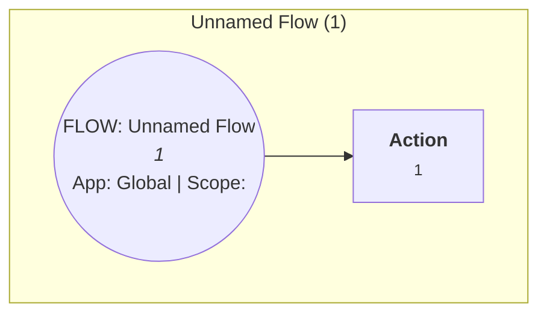

# ServiceNow Flow Relationship Report
**Generated:** 2026-04-26 15:16:10
**Root Flows Analyzed:** 1

## Executive Summary
Unified diagram showing 1 root flows + all recursive subflows and cross-relationships.

## Root Flows Overview
| Name | Sys ID | Domain | Scope / Application | Active | Flow Type | Last Updated |
|------|--------|--------|---------------------|--------|-----------|--------------|
| Unnamed Flow | `1` |  |  / Global | False | flow | None |

## All Flows & Subflows (including nested)
| Name | Sys ID | Domain | Scope | Active | Description |
|------|--------|--------|-------|--------|-------------|
| Unnamed Flow | `1` |  |  | False | ... |

## Unified Flow Diagrams (1 distinct groups)

### Group 1

*Tip: Copy the code block above into [mermaid.live](https://mermaid.live) or any Markdown viewer that supports Mermaid.*

## Generation Notes
- Subflows are expanded and deduplicated (appear only once).
- Cross-flow "calls" relationships are shown.
- Branching/conditions approximated from action names.
- Max recursion depth: 5 (prevents infinite loops).

---
*Report generated via ServiceNow MCP Agent — {now}*
